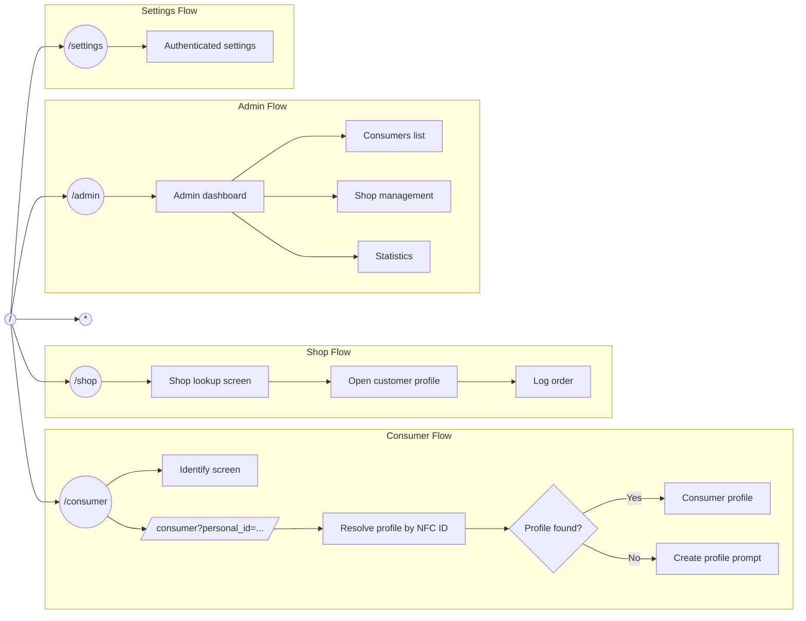

# TapCup PRD

## Overview
TapCup is a Base44 coffee experience with three primary roles:

- Consumer: a customer manages their coffee profile, preferences, and order history.
- Shop: a coffee shop identifies a customer and logs an order.
- Admin: a privileged operator manages consumers, shops, roles, and system statistics.

The product uses NFC-inspired identity, but the web app does not depend on real browser NFC scanning as the primary production path. Instead, a chip opens a canonical TapCup URL that carries a unique personal ID, the app saves state, and navigation is driven by URL redirect plus cached role context.

## Problem
Web NFC support is inconsistent across browsers and devices, which makes a direct browser-based scan flow unreliable for production use.

We need a flow that:

- Works reliably in the browser
- Keeps NFC hardware simple
- Preserves a fast tap-to-profile experience
- Allows the app to restore the correct user state from a URL

## Product Goal
Let a coffee customer tap an NFC chip, have the system resolve the chip's unique ID, and land on the correct consumer experience without requiring the browser to perform the NFC read itself. Also provide separate shop and admin experiences with explicit permission boundaries.

## Core Principle
The NFC chip stores only a canonical TapCup URL that includes a unique personal ID.

The app is responsible for:

- Saving or resolving the chip state
- Parsing the `personal_id` from the redirected URL
- Mapping the ID to a `CoffeeProfile`
- Keeping the canonical app base URL as `https://tap-cup.base44.app`
- Using cached role and page context to decide whether the redirect continues into consumer, shop, or admin flows

## Canonical Redirect Base

All NFC-driven redirects should be treated as page URLs under the main TapCup app base:

- `https://tap-cup.base44.app/consumer?personal_id=...`
- `https://tap-cup.base44.app/shop`
- `https://tap-cup.base44.app/admin`

Use the base URL as the canonical starting point for identity handoff, page routing, and flow descriptions in this PRD.

## New NFC Chip Setup

TapCup needs a simple flow for adding a new NFC chip to the app.

### Setup flow
1. An admin or shop staff opens the chip setup flow.
2. The app creates or assigns a new unique `personal_id`.
3. The app builds a canonical URL such as `https://tap-cup.base44.app/?personal_id=ABC123`.
4. The chip is associated with that canonical URL in the app.
5. The app uses cached role and page context to route the user into consumer, shop, or admin flow after the URL opens.

### Setup rules
- The chip should not store profile details beyond the canonical URL with the unique ID.
- The app should own the mapping between the chip and the profile.
- A new chip can be attached to an existing profile or seeded for a new profile.
- The setup flow should work without requiring browser NFC as a dependency.
- The app should use cache to remember the last role and target page so the same `personal_id` can continue into the correct flow.

## Roles and Permissions

TapCup separates access by role.

### Consumer
- Can view and edit their own profile
- Can manage preferences
- Can view personal order history
- Cannot access shop or admin tools

### Shop
- Can search for customers by NFC ID or phone
- Can view a limited customer profile summary
- Can log completed orders
- Cannot edit customer preferences, phone number, or NFC ID
- Cannot access admin tools

### Admin
- Can view consumers
- Can manage shops: add, edit, remove
- Can manage staff access and roles
- Can view statistics and usage trends
- Cannot silently change consumer-owned profile data without auditability

## Main Routes

TapCup uses a small set of primary routes:

- `/` for the home entry screen
- `/consumer` for customer identification and profile management
- `/shop` for barista lookup and order logging
- `/admin` for consumer oversight, shop management, and statistics
- `/settings` for account and app settings
- `*` for the not-found fallback

## User Flows

### Consumer onboarding
1. User taps NFC or enters their phone/NFC ID manually.
2. The app resolves the identity.
3. If a matching profile exists, the app loads that profile.
4. If no profile exists, the app prompts to create one.

### Shop onboarding
1. Shop staff opens the shop experience.
2. The app authenticates the user as shop staff or admin.
3. The app loads the shop lookup tools only.
4. Staff can search by NFC ID or phone.
5. The app shows the customer profile summary and order actions.
6. The shop user cannot edit consumer preferences or identity fields.

### Admin onboarding
1. Admin opens the admin experience.
2. The app authenticates elevated access with password-only sign-in, with no Google login flow.
3. The app loads consumer oversight, shop management, and statistics screens.
4. Admin can add, edit, or remove shops.
5. Admin can review consumers and system usage.

### NFC redirect flow
1. The chip contains a canonical TapCup URL with a unique personal ID query string.
2. The user taps the chip and the browser opens the saved URL.
3. The app receives `personal_id` from the URL and reads cached role/page context.
4. The app routes to the correct consumer, shop, or admin page.
5. The target page resolves the profile or lookup context from `personal_id`.

### Shop lookup
1. Barista scans or enters the customer identifier.
2. The app finds the profile by NFC ID or phone.
3. The app displays the customer profile and allows order logging.

### Shop UX story
1. The shop view opens to a customer profile summary with the consumer's default saved preference highlighted first.
2. The barista sees a large visual coffee cup graph that communicates the drink build at a glance, including water level, milk/foam level, and other drink ratios.
3. The primary preference is shown as the default "current cup" state, so the barista can start from the consumer's usual order.
4. The barista can switch to another saved preference if the customer wants a different drink.
5. Each preference shows clear parameters such as espresso shot count, foam on or off, water level, milk level, and any other tracked cup settings.
6. After selecting the desired preference, the barista logs the order from the same screen.

### Admin management
1. Admin opens the admin panel.
2. The app lists consumers, shops, and high-level statistics.
3. Admin updates shop records or staff access as needed.
4. The app logs administrative changes for auditability.

## Functional Requirements

- The app must support `personal_id` as a URL-driven profile lookup key.
- The app must resolve a `personal_id` into a `CoffeeProfile.nfc_id`.
- The app must preserve the existing manual lookup paths.
- The app must support profile creation when a chip ID is unknown.
- The app must keep the NFC chip data minimal: canonical URL plus the unique ID query string.
- The app must separate consumer, shop, and admin permissions by role.
- The app must prevent shop users from changing consumer preferences or identity data.
- The app must provide admin tools for consumer visibility, shop management, and statistics.
- Admin authentication must be password-only for now.
- Admin authentication must not require Google login.

## Non-Goals

- Real browser NFC support as the only production path
- Writing complex profile data directly onto the NFC chip
- Replacing Base44 entity storage with chip-side storage

## Data Model

### CoffeeProfile
Represents the customer identity.

Primary fields:

- `user_email`
- `display_name`
- `phone`
- `nfc_id`

### CoffeePreference
Represents a saved coffee order preference for a profile.

### Order
Represents a logged shop order and a snapshot of the preference used.

## Experience Requirements

- The consumer page should load a profile from `personal_id` automatically when present.
- The app should show a loading state while resolving the identifier.
- If no profile exists, the app should present a creation flow seeded with the chip ID.
- The UI should remain usable when NFC is unavailable by allowing manual input.
- Shop users should only see shop-specific tools and customer lookup actions.
- Admin users should see consumer oversight, shop management, and statistics dashboards.
- Admin sign-in should use a password-only flow.

## Acceptance Criteria

- A redirected URL like `/consumer?personal_id=ABC123` opens the matching consumer profile.
- If the profile exists, preferences and order history load automatically.
- If the profile does not exist, the app prompts for profile creation using the provided ID.
- The consumer experience still works with manual phone and NFC ID entry.
- The product does not require browser NFC support to function in production.
- Shop users cannot edit consumer preferences.
- Admin users can manage shops and view statistics.
- Admin access does not depend on Google login.

## Notes for Implementation

- Treat `personal_id` as the routing key and `nfc_id` as the persisted profile identifier.
- Keep the redirect flow deterministic so the app can restore state from the URL.
- If browser NFC is available, it can be treated as an optional enhancement, not a dependency.
